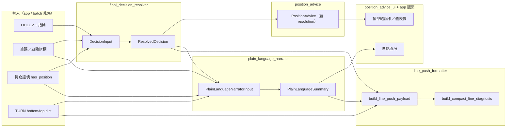
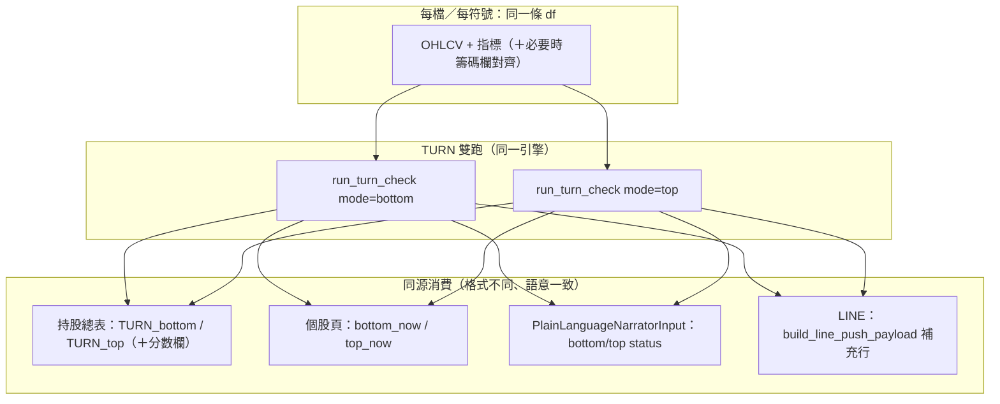

# 核心資料流與模組邊界（開發者說明）

本頁描述「裁決 → 白話 → 頁面／總表 → LINE」的**單一事實來源**與**可讀輸出**如何銜接。目標是維護時依結構而非記憶。

## 🔴 三大不可違反原則（TL;DR）

快速掃過即可；細節與反例見下文「契約規則」「常見錯誤修改示例」。

1. **所有投資結論只來自 `ResolvedDecision`** — 不要在 UI、`app`、推播旁**重新拼一套**買賣／燈號判斷。
2. **所有白話敘述只來自 `PlainLanguageSummary`** — 不要直接讀指標在畫面上「寫一句話」。
3. **所有 LINE 推播只走 `build_line_push_payload`** — 不要在按鈕旁 **inline** 組結論字串。

---

## 總覽（架構圖）

**精簡語意：**

| 步驟 | 產物 | 誰負責 |
|------|------|--------|
| 規則彙總 | `ResolvedDecision` | `resolve_final_decision(DecisionInput)` |
| 不改裁決的敘述 | `PlainLanguageSummary` | `build_plain_language_summary(decision, narrator_input)` |
| 持倉面板文案＋trace | `PositionAdvice` | `get_position_advice(...)`（內含 `resolution`） |
| LINE 單則文字 | `str` | `build_line_push_payload(mode=...)` |

---

## 🧱 核心資料物件（不可破壞）

下列為**跨模組契約**（型別定義於對應模組）。**欄位增刪或語意變更**時，請同步檢查 `final_decision_resolver`、`plain_language_narrator`、`line_push_formatter`、`position_advice_ui`／`app` 的銜接處，並補／跑相關測試。

| 物件 | 定義處 | 角色（一句話） |
|------|--------|------------------|
| `DecisionInput` | `final_decision_resolver` | 進 resolver 前**已蒐集**的盤面與規則訊號（分數、Gate／Trigger／Guard、持倉語境等）。 |
| `ResolvedDecision` | `final_decision_resolver` | **唯一裁決**：action／color／reason／摘要欄位；儀表條與 LINE 前段標籤皆應由此衍生。 |
| `PlainLanguageNarratorInput` | `plain_language_narrator` | 白話層輸入：裁決**之外**的盤面狀態（含 TURN status 等），**不修改**裁決。 |
| `PlainLanguageSummary` | `plain_language_narrator` | **唯一白話輸出**（含 `one_line_verdict`）；畫面與推播一句話應與此一致。 |

LINE 的**最終字串**為 `build_line_push_payload` 回傳的 `str` — 組裝規則集中在 `line_push_formatter`，勿另開平行組裝路徑。

---

## 模組職責（一句話）

| 模組 | 職責 |
|------|------|
| `final_decision_resolver.py` | 從 `DecisionInput` 產出**唯一裁決** `ResolvedDecision`（action / color / reason / `summary_title` / `summary_text` / trace）。LINE 前段標題與標籤亦由此契約衍生（`build_compact_line_diagnosis`、`get_status_bar_*`）。 |
| `plain_language_narrator.py` | 在**不修改** `ResolvedDecision` 的前提下，把裁決與盤面狀態翻成 `PlainLanguageSummary`（含 `one_line_verdict`）。 |
| `position_advice.py` | 組裝持倉建議敘事；內部呼叫 resolver，對外帶 `resolution` 供 UI 與其他區塊共用。 |
| `position_advice_ui.py` | 僅負責**呈現**：吃 `ResolvedDecision` + `PlainLanguageSummary`，不重新發明裁決邏輯。 |
| `line_push_formatter.py` | LINE **輸出契約**：TURN 字串、前段（`build_compact_line_diagnosis`）、尾段（補充／防守／風險／專家）、長度截斷；**單一入口** `build_line_push_payload`。 |
| `app.py` | 拉資料、建 `DecisionInput`／`PlainLanguageNarratorInput`、呼叫 resolver／narrator／formatter、Streamlit 狀態與總表列印。**不應**在這裡拼與裁決／白話重複的結論句。 |

---

## 個股頁 vs 持股總表：共用觀念

兩邊應對齊同一套語意（實作上總表為批次迴圈、個股為單一 `effective_symbol`）：

- **裁決欄位**（總表 DataFrame 常見欄名）：`final_action`、`final_color`、`final_state`、`primary_reason`、`summary_title`、`summary_text` — 皆來自同一 `ResolvedDecision` 概念。
- **白話**：總表可能存 `plain_summary_short` 或展開為 markdown；個股用 `PlainLanguageSummary` 物件；**一句話**欄位應與 `one_line_verdict` 同源。
- **TURN**：個股頁 `run_turn_check(..., mode="bottom"|"top")` 的 dict；總表對應 `TURN_bottom` / `TURN_top`（及分數欄）。LINE 推播經 `build_line_push_payload` 內部格式化成 `補充：TURN bottom｜…`。
- **AI 分數**：進 `DecisionInput` 與畫面分數顯示；與裁決 tie-break 規則見 resolver 實作。

### TURN 與批次總表：同源資料流（小圖）

個股與總表**不各自發明** bottom／top 狀態：同一條已對齊的價量 df（必要時併入籌碼序列）進 `turn_check_engine`，**固定雙跑** `bottom` 與 `top`，再依場景寫入欄位或傳給白話／LINE。**不要在 app 或 formatter 內用原始 EMA 手刻一套「類 TURN」文案。**

裁決本身仍由 `DecisionInput`（分數、Gate、Trigger、Guard 等）進 resolver；上圖強調 **TURN 雙 dict 的單一來源**，避免與儀表條／白話／推播「各說各話」。

---

## 契約規則：哪裡只讀、哪裡不要重算文案

**應視為「只讀契約」、用現成欄位或封裝函式：**

- 儀表條／卡片標題與標籤：`get_status_bar_title`、`get_status_bar_label`、`get_status_bar_label_for_score`（`final_decision_resolver`）。
- LINE 推播前段（與頁面結論一致）：`build_compact_line_diagnosis` 或僅呼叫 `build_line_push_payload`。
- 白話段落：`build_plain_language_summary` 的 `PlainLanguageSummary` 欄位；一句話用 `one_line_verdict`。

**不應在 app 內**再寫一套「等同 `summary_title`／`one_line_verdict`／儀表條標籤」的 if-else 字串，除非該處是純 UI 標籤（例如按鈕文字）且與投資結論無關。

### 常見錯誤修改示例（反例）

維護時若直覺想「在畫面上改一句比較順」，先對照下表，避免契約漂移。

| 不要這樣做 | 應該這樣做 |
|------------|------------|
| 在 `app.py` 依分數或情緒重拼一套「推薦買入／建議觀望」結論文案 | 改裁決規則 → `resolve_final_decision`（`final_decision_resolver`）＋ resolver 測試 |
| 在 UI 依 `close` 與 EMA5 直接判燈號、標題，不經 `ResolvedDecision` | 儀表條與標題一律用 `get_status_bar_*`／`ResolvedDecision` 欄位 |
| 在 `line_push_formatter` 讀原始指標或重寫「一句話」 | 前段一句話只來自 `build_compact_line_diagnosis`（已吃裁決＋白話契約）；格式與尾段只在 formatter 組裝，不重新解讀盤面 |
| 在總表或個股頁另算一套 TURN 文字，與 `run_turn_check` 不一致 | 只消費 `run_turn_check` 的 bottom／top dict（見上方小圖） |
| 為了 LINE 好讀，在推播鈕旁邊 inline 拼結論段落 | 只呼叫 `build_line_push_payload`；改版面只動 `line_push_formatter` |

---

## LINE 推播（精簡 vs 完整）

- **唯一組裝入口**：`build_line_push_payload(..., mode="compact"|"full")`（`line_push_formatter.py`）。
- 精簡版尾段行為見該模組頂部 docstring（補充 1 行、防守最多 1 行、風險最多 2 行、無專家全文）。

---

## 測試落點（快速對照）

| 區塊 | 測試檔（範例） |
|------|----------------|
| Resolver / 契約 | `tests/test_resolver.py` |
| LINE 格式 | `tests/test_line_push_formatter.py` |

新增功能時：優先在**對應模組**補測，避免只在 `app.py` 用手動點擊回歸。

---

## 變更時建議順序

1. 若改「規則或嚴重度」→ `final_decision_resolver` + resolver 測試。  
2. 若改「使用者聽得懂的說法」→ `plain_language_narrator`（不改裁決結果）。  
3. 若改「手機／LINE 版面」→ `line_push_formatter`。  
4. 若改「區塊排版」→ `position_advice_ui` 或 `app.py` 版面區塊。

此順序可避免契約在多處漂移。
